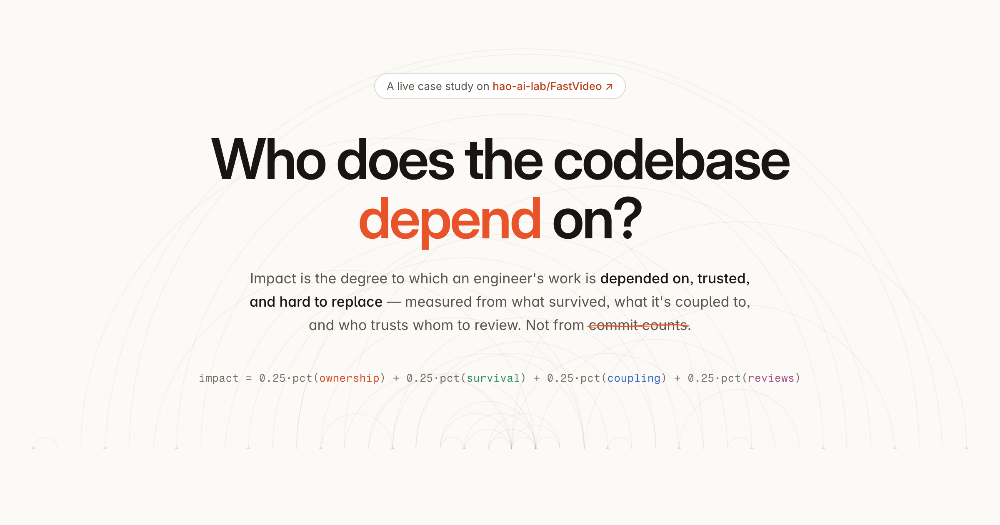

# Engineering Impact Dashboard

**Who does a codebase actually depend on?** A live case study ranking the 82 contributors of
[hao-ai-lab/FastVideo](https://github.com/hao-ai-lab/FastVideo) by **impact rather than
activity** — what survived, what it's coupled to, and who's trusted to review. Commit counts are
a rejected baseline, shown only as a contrast.

### ▶ [Explore the live dashboard](https://sbui056.github.io/engineering-metrics/)

**Same engine, second repo:**
[**impact/comfyui**](https://sbui056.github.io/engineering-metrics/comfyui/) — the analysis run
against [Comfy-Org/ComfyUI](https://github.com/Comfy-Org/ComfyUI) (120k★). Two very different
organizational shapes — a distributed research lab and a famously solo-led project — read by one
pipeline: every number, chart, and sentence on both pages is derived from the target repo's data.

[](https://sbui056.github.io/engineering-metrics/)

Highlights worth clicking:

- **[The leaderboard](https://sbui056.github.io/engineering-metrics/#leaderboard)** — 82 people,
  four signals each, grouped into uncertainty tiers so small-sample ranks aren't overclaimed.
- **[Compare two contributors](https://sbui056.github.io/engineering-metrics/#cmp=William%20Lin,Zhang%20Peiyuan)**
  — side-by-side signals plus the shared-surface story: 107 files co-owned, but one of them is the
  sole owner of 312 files (bus-factor risk made concrete).
- **The weight-mixer lab** (in the Method section) — disagree with equal weights? Drag them and
  watch the board re-rank live, while the published ranking stays honest.

## The idea

Impact = the degree to which an engineer's work is **depended on, trusted, and hard to replace**.
Four independent, percentile-normalized signals are derived from git history and GitHub reviews —
**ownership concentration** (surviving-blame share of the files you're the major owner of),
**code survival** (durability of your contributions, tenure-normalized), **co-change coupling
criticality** (PageRank centrality of the files you own in the commit co-change graph), and
**review leverage** (reviews given, weighted by distinct authors reviewed for) — and combined
with equal weights into a single, one-sentence-explainable score. The dashboard presents the
ordered leaderboard with per-contributor drill-downs showing the evidence behind each score, and
a persistent "signals, not verdicts" caveat layer that is honest about bus-factor risk, what the
metrics can't see, and how they can be gamed.

## How it works

The full signal definitions, data contract, and scoring are documented in
[docs/methodology.md](docs/methodology.md). The results on the target repository — the
leaderboard, a measured contrast against the rejected commit-count and lines-of-code baselines,
and the defense of the main design decisions — are in [docs/writeup.md](docs/writeup.md).
What happens when the same engine reads two opposite org shapes — the distributed lab vs the
solo-led project — is in [docs/comparison.md](docs/comparison.md).

## Running

This repo is the analysis tool; it scans an external target repository. Point it at a local clone
and run the pipeline:

```
pip install -r requirements.txt
REPO_PATH=/path/to/target-repo make all
streamlit run dashboard.py
```

Outputs are written to `data/`; the dashboard reads `data/scored.parquet`.

### Static site

`make site` builds a self-contained, dependency-free version of the dashboard at
`dist/index.html` — all data, styles, and scripts inlined, no external requests — which can
be opened directly in a browser (or served with `python -m http.server -d dist`) and hosted
anywhere as a single file. The Streamlit app remains the interactive dev/analysis view.

`make deploy` builds with the public URL baked into `og:image`, renders the OG card, and stages
the site into `docs/` for GitHub Pages (Settings → Pages → deploy from branch → `main` /`docs`).
For any other host, set `SITE_URL` yourself:

```bash
SITE_URL=https://your-host.example/path make site
```

The reviews step calls the GitHub API. It authenticates with `GITHUB_TOKEN` (environment or a
local `.env`), falling back to the `gh` CLI's stored credential; with no token it degrades to a
partial fetch and the pipeline marks the review signal as imputed rather than failing. API
responses are cached under `.cache/` so reruns only refetch PRs that changed.
